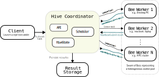

# Summary

BeeMesh is a lightweight distributed computing framework for scientific workloads across heterogeneous machines. It provides a central coordinator ("Hive") and connected worker processes ("Bees") that execute tasks and return results. BeeMesh targets independent or lightly coupled workloads across heterogeneous machines.

BeeMesh currently supports three execution styles: distributed Python loop
iterations through `beemesh.parallel()` or `beemesh.swarm()`, uploaded
executables or wrapper scripts for single-run and parameter-sweep workflows,
and an experimental structured-grid path for tiled two-dimensional advection
with ghost-cell exchange as a proof of concept for future distributed PDE
workflows.

# Statement of need

Many scientific users have access to multiple underutilized machines but do not
want to operate or depend on full-featured cluster software. Existing
distributed systems such as Ray and Dask are powerful, but they typically
assume a managed cluster environment or require more explicit distributed
programming patterns. Large-scale volunteer systems such as BOINC target a
different operating regime and involve higher operational overhead than is
necessary for small collaborative multi-machine experiments.

BeeMesh addresses a narrower need: turning a local scientific workload into a
distributed run across a small, heterogeneous pool of machines with minimal
setup. The framework is intended for parameter sweeps, repeated case execution,
teaching demonstrations, and early-stage distributed numerical experiments. The
goal is not to present BeeMesh as a production-ready distributed PDE runtime,
but rather as a compact research software platform for exploring volunteer
execution and lightweight distributed scientific workflows.

BeeMesh occupies a middle ground between cluster frameworks and large-scale
volunteer systems by enabling small-scale distributed execution with minimal
configuration. It complements tools such as Ray and Dask while remaining
simpler than large-scale volunteer computing infrastructures such as BOINC
[@moritz2018ray; @rocklin2015dask; @anderson2004boinc].

# Architecture and execution model

BeeMesh follows a coordinator-worker architecture. The Hive exposes a FastAPI
service for worker registration, heartbeats, task requests, result submission,
and job submission. The Hive maintains in-memory runtime state, including
workers, tasks, and results. Scheduling is handled by a dedicated module that performs hard
eligibility filtering and heuristic task selection.

Bee workers register with the Hive together with basic capability metadata,
including CPU cores, RAM, architecture, and optional GPU-related fields. The
worker then enters a loop that requests leased tasks, executes them locally,
sends heartbeats, and submits structured success or failure results back to the
coordinator.

The scheduler combines several explicit heuristics:

- hard filtering based on resource requirements (CPU, RAM, GPU, architecture);
- worker-strength scoring based on resources and load;
- scarcity-aware prioritization to avoid blocking constrained tasks; and
- bounded age-based task priority to reduce starvation of older queued tasks.

On top of the coordinator-worker runtime, BeeMesh includes two main user-facing
launch paths. The Python launch path parses a single `beemesh.parallel()` or
`beemesh.swarm()` block, evaluates the iterable locally, batches cases, and
submits remote execution tasks. The executable launch path uploads a local
binary or wrapper script and dispatches it as either a single-run workload or a
parameter sweep. In addition, the current prototype includes an experimental
grid execution path for tiled structured fields, demonstrated through a 2D
advection example with ghost-cell exchange.

# Capabilities and included examples

BeeMesh supports multiple classes of distributed workloads within a unified
coordinator-worker runtime.

First, BeeMesh can distribute independent Python workloads, including case
sweeps, Monte Carlo simulations, and neural-network hyperparameter searches.
These examples illustrate the automatic decomposition of loop-based workloads
into remote execution tasks with minimal user modification.

Second, BeeMesh supports execution of compiled binaries, enabling existing
simulation codes written in languages such as C, C++, or Fortran to be
distributed across workers without rewriting them in Python. Both single-run
and parameter-sweep execution modes are demonstrated.

Third, BeeMesh includes an experimental structured-grid execution path,
demonstrated through a tiled two-dimensional advection example. This example
introduces domain decomposition and ghost-cell exchange between subdomains,
serving as a proof of concept for future distributed PDE workflows.

These examples demonstrate support for independent tasks, executable workflows,
and early-stage coupled simulations.

# Quality control

BeeMesh includes unit tests for core runtime components and uses GitHub Actions
for continuous integration. Multi-machine execution is validated through
example workflows and manual testing.

# Limitations and future work

BeeMesh remains early-stage research software. The Hive stores runtime state in
memory, so restarts do not preserve active jobs. GPU detection is currently
minimal, limiting GPU-aware scheduling. The structured-grid PDE workflow is
experimental and limited to the included advection example. That path
uses Hive-mediated synchronization between timesteps rather than persistent
subdomain-resident workers or direct worker-to-worker halo exchange.

Future work includes persistent state, improved hardware detection, more general
PDE kernels, and enhanced fault tolerance.

# Acknowledgements

The authors acknowledge the open-source scientific Python ecosystem, including
FastAPI, NumPy, and pytest. The authors also thank **Prof. Steven H. Frankel** for
helpful discussions and support. The authors acknowledge the use of AI-assisted
tools for minor code generation, debugging, and documentation drafting; all
outputs were reviewed and validated by the authors.
